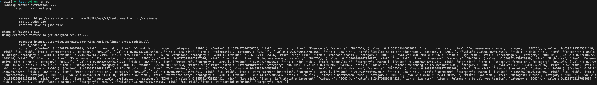

# Pretraining Approach for Small-sample Training Employing Radiographs (PASTER): a multimodal transformer trained by chest radiograph and free-text reports

<details>

<summary><b>Pretraining Approach for Small-sample Training Employing Radiographs (PASTER): a multimodal transformer trained by chest radiograph and free-text reports</b>, XXX. XXX (XXX) \<a href="<https://linchin.ndmctsgh.edu.tw/>", target="blank"\>[Paper]</a></summary>

```bash
Kaicheh , Chen., Chin, Lin., Patel, P. et al. Pretraining Approach for Small-sample Training Employing Radiographs (PASTER): a multimodal transformer trained by chest radiograph and free-text reports. XXX. XXX (XXX). URL
```

</details>


This repository contains code to train a self-supervised learning model on chest X-ray images that lack explicit annotations and evalute this model's performance on pathology-classification tasks.

<details>

<summary>
    <b>Main Findings</b>
</summary>

</details>


## Dependencies
To clone all files:

```git clone https://github.com/ji9su/PASTER.git```

To install Python dependencies:

```pip install -r requirements.txt```

## Data 
### Training Dataset


### Evaluation Dataset


## Running Training
Run the following command to perform CheXzero pretraining. 
```bash
python run_train.py --file_path "./data/example_data.csv"
```

### Arguments
* `--file_path` Directory to load chest x-ray image data from.

Use `-h` flag to see all optional arguments. 

## Image-Feature probability predictions
```python
from zero_shot import run_single_prediction

# This function will make probability predictions
img_feat, img_path_list = run_single_prediction(
    cxr_labels = cxr_labels,
    model = model, 
    loader = loader,
    device = device,
    template = None,
    softmax_eval = True,
    context_length = 256,
    is_feature_extraction = True
)
```

## Zero-Shot probability predictions
```python
from zero_shot import run_single_prediction

# This function will make probability predictions
img_feat, img_path_list = run_single_prediction(
    cxr_labels = cxr_labels,
    model = model, 
    loader = loader,
    device = device,
    template = template,
    softmax_eval = True,
    context_length = 256,
    is_feature_extraction = False
)
```
### Arguments
* `cxr_labels: List[str]`: List of pathologies to query in each image
* `model: PyTorch model`: Trained clip model
* `loader: PyTorch data loader`: Loads in cxr images
* `device: torch.device`: The device to put the loaded model
* `template: str`: Template to input into model 
* `softmax_eval: boolean`: Use +/- softmax method for evaluation
* `context_length: int`: Max number of tokens of text inputted into the model
* `is_feature_extraction: boolean`: Optional feature-extraction or zero-shot

## API predictions
###  :rocket: REST APIs (`https://aiservice.tsghaiot.com/PASTER/api/v1`)
:point_right: **_Quick test use this [api link](https://aiservice.tsghaiot.com/PASTER/api/v1/feature-extraction/)_** 
>    Now, the apis can provide the following service:
>    - [x] Single CXR image feature extraction (v001)
>    - [ ] Multi-CXR images feature extraction
>    - [x] Provide several results using linear probe methods

#### :one: Feature Extraction API
```
    POST /feature-extraction/cxr/image?name=XXX
    Input:
        QueryParameter : name (UserName)
        File : CXR image (Not supported multiple image)

    Response:
        Status : 200 OK
        Content : {
            "user" : str,
            "extracted_feature" : [Float]}
        
        extracted_feature shape : (512,)
```

#### :two: Linear Probe Methods
```
    POST /linear-probe/models/all
    
    Input:
        data : feature result from feature extraction api

    Response:
        Status : 200 OK
        Content : [{
            "uid"  : int,
            "value": float,
            "risk" : str,
            "name" : str
            },
            {
            "uid"  : int,
            "value": float,
            "risk" : str,
            "name" : str
            }...
            ]
```

#### :three: Run the api_predict script [run.py](./api_predict/run.py)



## Issues
Please open new issue threads specifying the issue with the codebase or report issues directly to kaichiehkj@gmail.com.

## Citation
```bash
Kaicheh , Chen., Chin, Lin., Patel, P. et al. Pretraining Approach for Small-sample Training Employing Radiographs (PASTER): a multimodal transformer trained by chest radiograph and free-text reports. XXX. XXX (XXX). URL
```